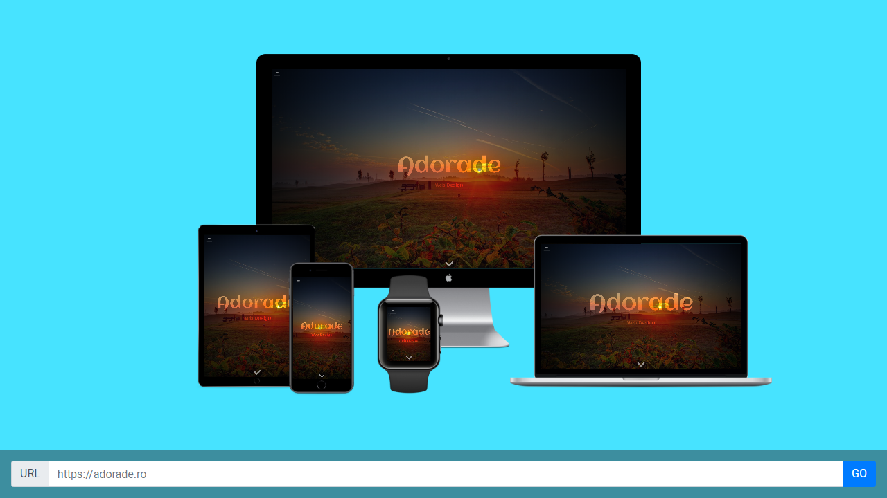

# Respo

> Reponsive design check tool, see how your website looks on lots of device sizes

## Usage

Check out [Respo Tool](https://res.adorade.ro)

## License

See the [LICENSE](LICENSE) file for license rights and limitations (MIT).
